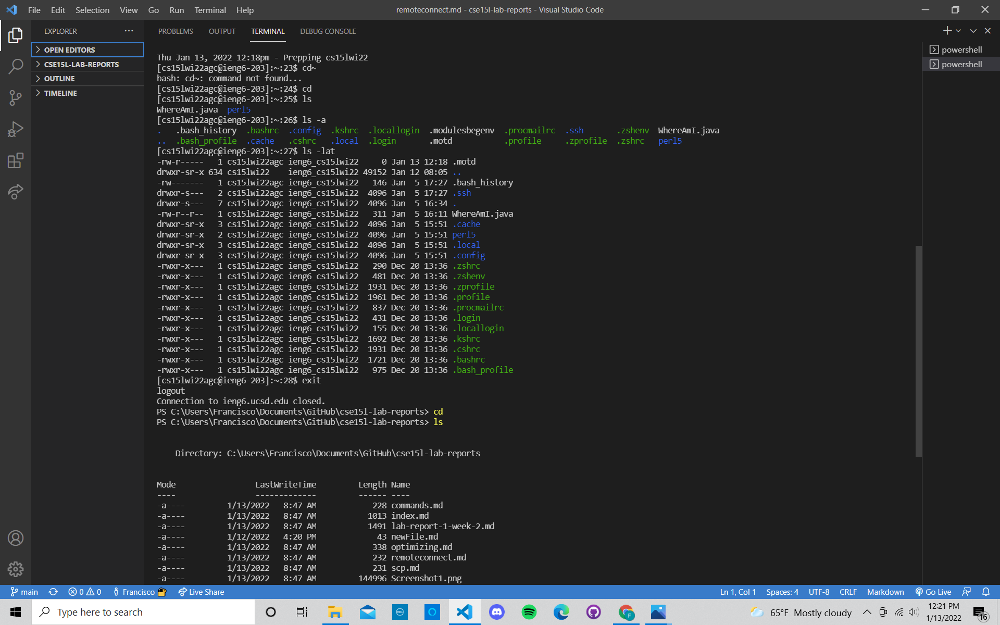

# **STEP 3: Trying some Commands**
After connecting to the server `ieng6`, try running these commands in the terminal(**this is not an exhaustive list**):
* `cd`
* `cd~`
* `ls -lat`
* `ls -a`
* `mkdir`
* `pwd`

Now try running some commands on your client. To do this, logout of the `ieng6` server 
simply by using `ctrl D` or typing `exit` and pressing enter in the terminal.

The image below shows the commands I ran on `ieng6` server and my Windows laptop after logging out (respectively).

.

What do you think these commands do? I tried various `ls`commands. To my findings, `ls` produces a list of files or directories. 

**Visit [STEP 4](https://francgarcia.github.io/cse15l-lab-reports/scp.html) or go back to the [main blog post](https://francgarcia.github.io/cse15l-lab-reports/lab-report-1-week-2.html).**
