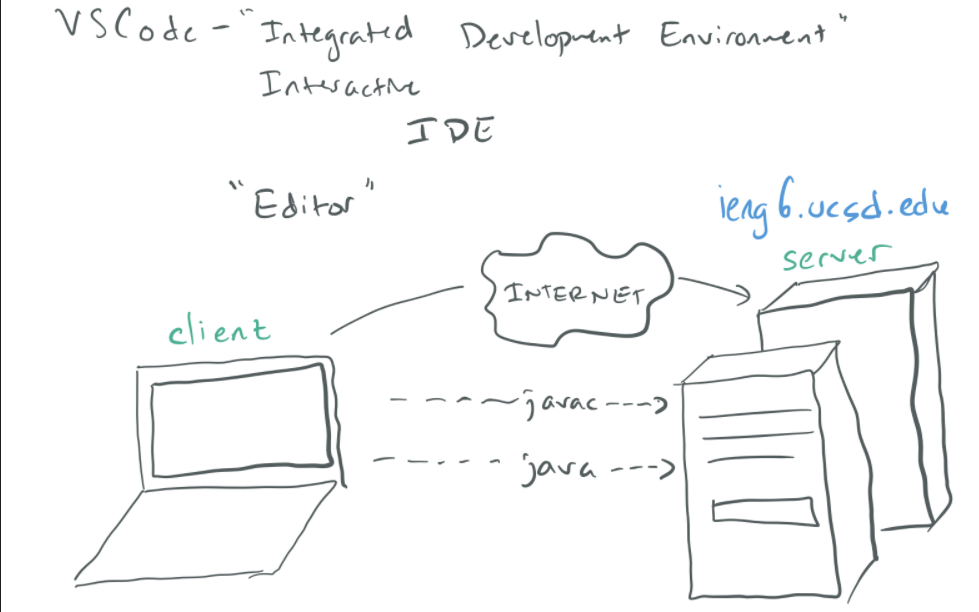

# Lab Report 1

## How to log into a course-specific account on ieng6 (a remote server).

*By: **Francisco Garcia***

*Course: CSE15L*

---

To begin logging into a course-specific account on ieng6, we first must understand what ieng6 is.
In it's most primitive terms, ieng6 is a remote server for clients utilizing "editors" such as 
Visual Studio Code.

For example, imagine you are on your laptop and you want to connect to the 
computer servers in the Computer Science Laboratory at UCSD.

The purpose of this is to execute powerful calculations that your small laptop simply can't perform.
Some calculations just require a lot of work. That is where these servers come in handy for individuals to 
perform these complicated calculations.

Below is a quick sketch by Professor Politz describing what this process is like.

---
> **IMPORTANT:** All of the steps described below are the same steps I took (I have Windows operating system).
> For simple understand, the directions are written in second person.
---

# **STEP 2: Connecting Remotely**

If you have Windows operating system,  **first install** [OpenSSH](https://docs.microsoft.com/en-us/windows-server/administration/openssh/openssh_install_firstuse) which will allow you to actually connect to the course-specific account through the remote computer or server.

After following the instructions found in OpenSSH installation, **look up your course-specific account for CSE15L** [here](https://sdacs.ucsd.edu/~icc/index.php).

**NOTE:**
You will have an account for each course you are taking.
Make sure to find the one that correpsonds to CSE15L and
reset the password following the steps located in that webpage.

**Now follow these instructions:**
1. Open VSCode.
2. Open a new terminal in VSCode using the menu at the top or type `ctrl + '`
3. In the terminal, type the command `ssh cs15lwi22agc@ieng6.ucsd.edu` but replace `cs15lwi22agc`
   with your course-specific username.
4. You will you get an output question (yes/no), simply type yes and press enter.
5. Enter a custom password or press enter (the password will not show it as you type so write it down so you don't forget).

**IMPORTANT:**
**Your terminal should display something similar to the image below.**

The above image describes that your terminal/laptop is now connected to the computers in the CSE building!
Any commands you run on your terminal will run on these computers (servers)!

---

**STEP 3**

---

**STEP 4**

---

**STEP 5**

---

**STEP 6**

---

**STEP 1: [Installing VS Code](https://francgarcia.github.io/cse15l-lab-reports/vscode.html)**

**STEP 2: [Connection Remotely](https://francgarcia.github.io/cse15l-lab-reports/remoteconnect.html)**

**STEP 3: [Trying some commands](https://francgarcia.github.io/cse15l-lab-reports/commands.html)**

**STEP 4: [Moving files with scp](https://francgarcia.github.io/cse15l-lab-reports/scp.html)**

**STEP 5: [Setting an SSH key](https://francgarcia.github.io/cse15l-lab-reports/sshkey.html)**

**STEP 6: [Optimizing remote running](https://francgarcia.github.io/cse15l-lab-reports/optimizing.html)**
