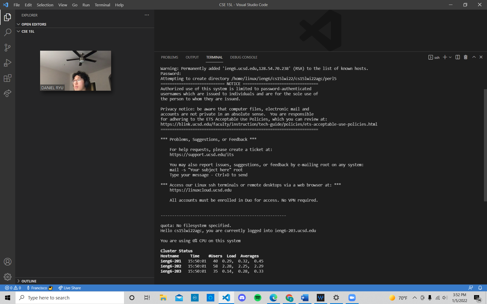
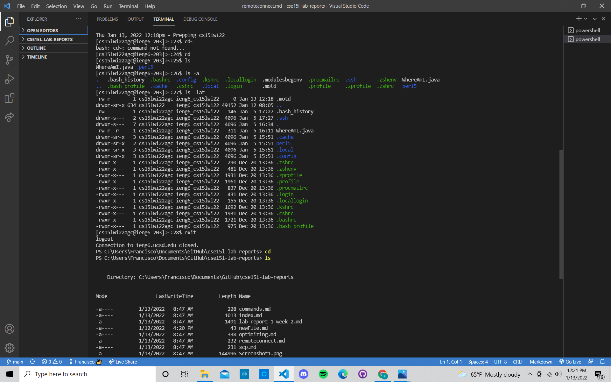
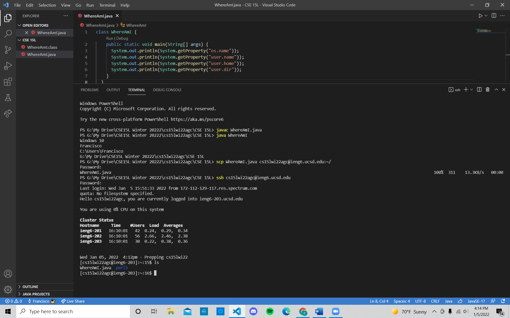
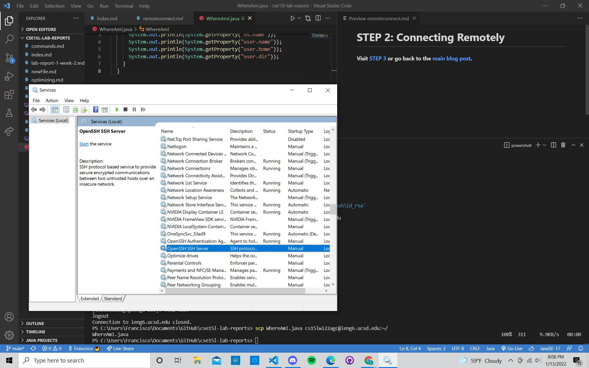
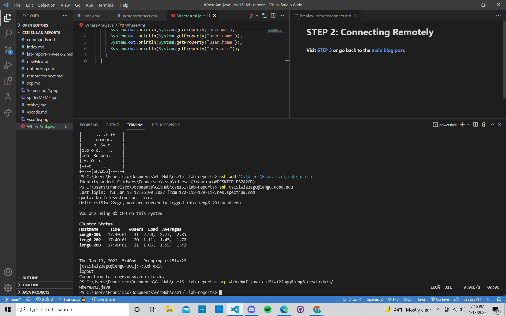
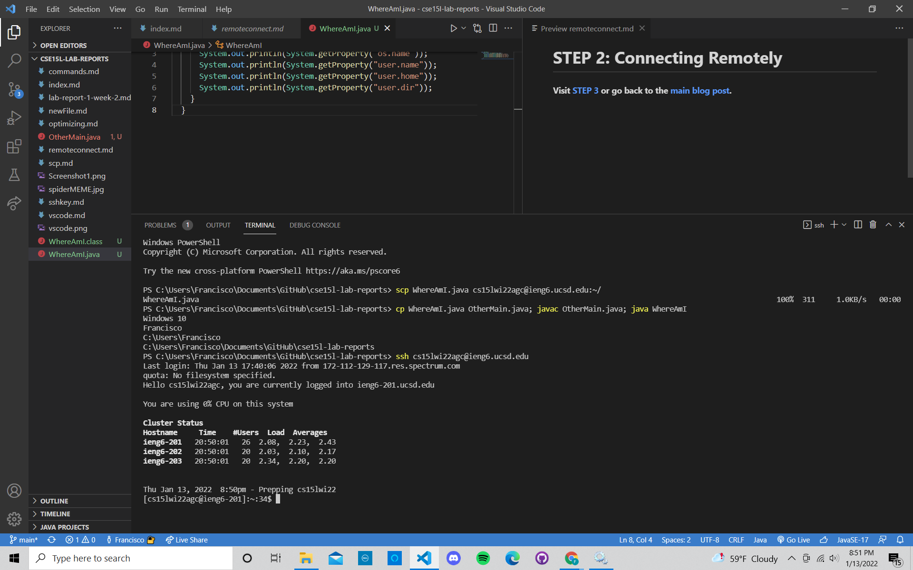
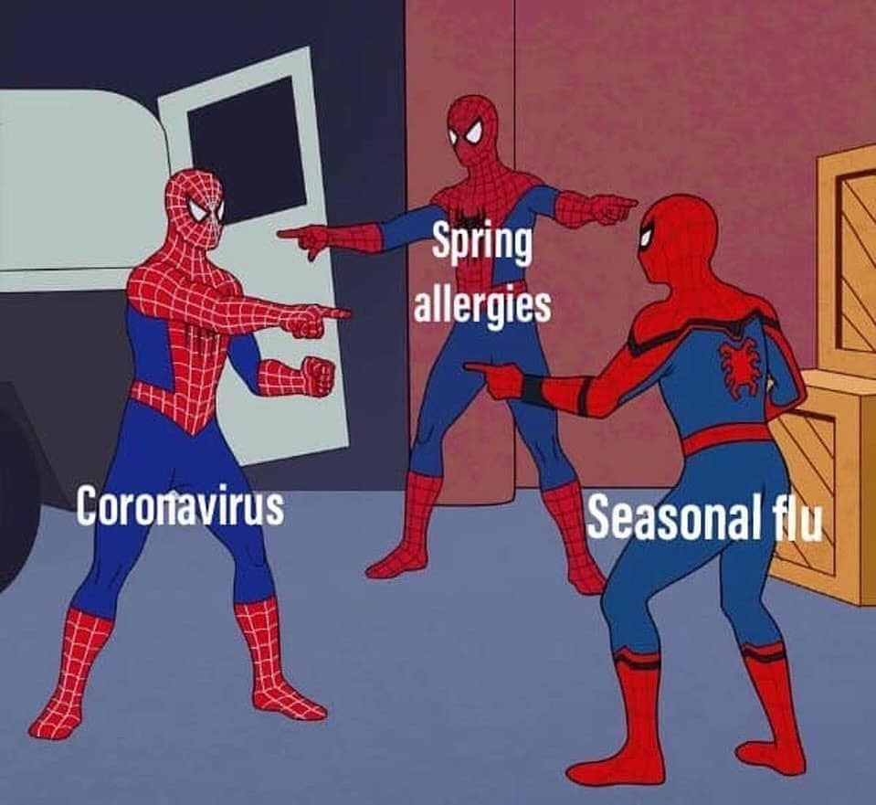

# Lab Report 1

## How to log into a course-specific account on ieng6 (a remote server).

*By: **Francisco Garcia***

*Course: CSE15L*

---

To begin logging into a course-specific account on `ieng6`, we first must understand what `ieng6` is.
In it's most primitive terms, `ieng6` is a remote server for clients utilizing "editors" such as 
Visual Studio Code.

For example, imagine you are on your laptop and you want to connect to the 
computer servers in the Computer Science Laboratory at UCSD.

The purpose of this is to execute powerful calculations that your small laptop simply can't perform.
Some calculations just require a lot of work. That is where these servers come in handy for individuals to 
perform these complicated calculations.

---
> **IMPORTANT:** All of the steps described below are the same steps I took (I have Windows operating system).
> For simple understanding, the directions are written in second person.
---

# **STEP 1: Installing VSCode**

---
# **STEP 2: Connecting Remotely**

If you have Windows operating system,  **first install** [OpenSSH](https://docs.microsoft.com/en-us/windows-server/administration/openssh/openssh_install_firstuse) which will allow you to actually connect to the course-specific account through the remote computer or server.

After following the instructions found in OpenSSH installation, **look up your course-specific account for CSE15L** [here](https://sdacs.ucsd.edu/~icc/index.php).

**NOTE:**
You will have an account for each course you are taking.
Make sure to find the one that correpsonds to CSE15L and
reset the password following the steps located in that webpage.


**Now follow these instructions:**
1. Open VSCode.
2. Open a new terminal in VSCode using the menu at the top or type `ctrl + '`
3. In the terminal, type the command `ssh cs15lwi22agc@ieng6.ucsd.edu` but replace `cs15lwi22agc`
   with your course-specific username.
4. You will you get an output question (yes/no), simply type yes and press enter.
5. Enter a custom password or press enter (the password will not show it as you type so write it down so you don't forget).

**IMPORTANT:**
**Your terminal should display something similar to the image below.**



The above image describes that your terminal/laptop is now connected to the computers in the CSE building!
Any commands you run on your terminal will run on these computers (servers)!

---

# **STEP 3: Trying some Commands**
After connecting to the server `ieng6`, try running these commands in the terminal(**this is not an exhaustive list**):
* `cd`
* `cd~`
* `ls -lat`
* `ls -a`
* `mkdir`
* `pwd`

Now try running some commands on your client. To do this, logout of the `ieng6` server 
simply by using `ctrl D` or typing `exit` and pressing enter in the terminal.

The image below shows the commands I ran on `ieng6` server and my Windows laptop after logging out (respectively).



What do you think these commands do? I tried various `ls`commands. To my findings, `ls` produces a list of files or directories. 

---

# **STEP 4: Moving Files with SCP**
Now, let's say that you want to move files from your computer to a remote computer/server.
One way to do this is by using the `scp` command on your client (not when you're logged into a server like `ieng6`).

**Try this:**
1. Log out of `ieng6` using `exit` in the terminal (if you haven't already).
2. Create a file on your computer called `WhereAmI.java`.
3. Copy and paste these contents into the file:
   ```
   class WhereAmI {
    public static void main(String[] args) {
     System.out.println(System.getProperty("os.name"));
     System.out.println(System.getProperty("user.name"));
     System.out.println(System.getProperty("user.home"));
     System.out.println(System.getProperty("user.dir"));
    }
   }
   ```
3. Run the file using `javac` and `java` commands as you have learned in previous courses (*CSE11 or CSE8B*). Skip this step if you don't have `java` installed in your computer.
4. Now run `scp WhereAmI.java cs15lwi22agc@ieng6.ucsd.edu:~/` with `cs15lwi22agc` replaced with your username. You should be asked for a password (it is the same as when you logged into your course-specific account using `ssh` in **STEP 2**).
5. Now log back into `ieng6` like you did in **STEP 2** and enter `ls` in the terminal. You will find the WhereAmI.java file in your home directory.
   You can run this file in `ieng6` now, using `javac` and `java`.
   


The image above shows what the same steps that I took (as described above), and the WhereAmI.java file in the home directory.

---

# **STEP 5: Setting an SSH key**

Consistently logging into your course-specific account onto `ieng6` takes a lot of time, especially typing in your password every time.

To automate this process a little, you can use `ssh` keys.

**Try the following:**
1. Type `ssh-keygen` in your terminal.
2. The terminal will then ask you a series of questions such as passphrase.
3. Press `enter` three times (or you can make a passphrase but make sure to remember it!).
   Your output will look something like this:
   ```
   PS C:\Users\Francisco\Documents\GitHub\cse15l-lab-reports> ssh-keygen
   Generating public/private rsa key pair.
   Enter file in which to save the key (C:\Users\Francisco/.ssh/id_rsa): 
   C:\Users\Francisco/.ssh/id_rsa already exists.
   Overwrite (y/n)? y
   Enter passphrase (empty for no passphrase): 
   Enter same passphrase again: 
   Your identification has been saved in C:\Users\Francisco/.ssh/id_rsa.
   Your public key has been saved in C:\Users\Francisco/.ssh/id_rsa.pub.
   The key fingerprint is:
   SHA256:8HUcJGvtSo5yoT8lIepsJZupofoSwju2hX1R7fPQfJQ francisco@DESKTOP-ES7A2CB
   The key's randomart image is:
   +---[RSA 3072]----+
   |        .  = ..  |
   |      .. .+ +E   |
   |      oooooo.    |
   |.    o .S=.o..   |
   |o.o o o..==..    |
   |.oo= Bo ooo.     |
   |.=..O  +.        |
   |=+=o    ..       |
   +----[SHA256]-----+
   ```
   
   **NOTE: Your output may differ slightly by note having the `Overwrite (y/n)?`. I simply got this question because I have already done this process. If you have done this        process before, you will have the same question as I recieved.**
   
4. Then type `ssh-add 'C:\Users\Francisco\.ssh\id_rsa'` into your terminal (only difference is the username after `Users/`).
5. If you recieve an output stating the directory does not exist, open your search menu on your laptop, and search for `services`.
6. Once in **services**, scroll down to **OpenSSH Server**. Click on it, and change the status to `Manual`.
7. Now open the search bar once more, and find **Windows PowerShell**. Open this and click on `run as Administrator`.
8. Then a PowerShell terminal will open up. Type in these commands one-by-one:
   * `Get-Service ssh-agent | Set-Service -StartupType Manual`
   * `Start-Service ssh-agent`
   * `Get-Service ssh-agent`
   * `ssh-add 'C:\Users\Francisco\.ssh\id_rsa'`, but instead of `Francisco`, input the username of the laptop from which you're currently logged in as.
   
9. You should get an output in the PowerShell stating that the "identity" was added to your desktop.
10. Now to ensure this is correct, go back to VSCode and type `ssh-add 'C:\Users\Francisco\.ssh\id_rsa'` into the terminal (you should get the same output as the previous step).
11. Now type `ssh cs15lwi22agc@ieng6.ucsd.edu` into the terminal and your password once more.
12. Enter `mkdir .ssh` into the terminal.
13. Logout using `exit`.
14. Now enter `scp /Users/Francisco/.ssh/id_rsa.pub cs15lwi22@ieng6.ucsd.edu:~/.ssh/authorized_keys`, with `Francisco` being replaced with your username.
15. If you followed these steps correctly, the terminal should no longer ask for your password whenever you use the `ssh` or `scp` commands.

Below is an image of changing **OpenSSH Server** to `Manual`.


Below is an image of how the terminal should respond by no longer requiring your password whenever using the `ssh` or `scp` commands.


---

# **STEP 6: Optimizing Remote Running**
Now you're ready to go! In this class, you will always want to optimize as much as possible.
* In the case of remote running, you can use quotation marks for certain commands that you would like 
to run directly in the remote server.
* You can also use semicolons to run multiple commands in your terminal on one line.
* Don't forget! You can also use the `^` arrow to recall the prevoius commands.

Below is an image displaying how using  `;` and `^` looks like. Give it a try!




---

And *that* is how you log into a course-specific account in `ieng6`!
I really hope that helped! Don't forget, stay healthy amidst this pandemic!

---




---


**STEP 1: [Installing VS Code](https://francgarcia.github.io/cse15l-lab-reports/vscode.html)**

**STEP 2: [Connection Remotely](https://francgarcia.github.io/cse15l-lab-reports/remoteconnect.html)**

**STEP 3: [Trying some commands](https://francgarcia.github.io/cse15l-lab-reports/commands.html)**

**STEP 4: [Moving files with scp](https://francgarcia.github.io/cse15l-lab-reports/scp.html)**

**STEP 5: [Setting an SSH key](https://francgarcia.github.io/cse15l-lab-reports/sshkey.html)**

**STEP 6: [Optimizing remote running](https://francgarcia.github.io/cse15l-lab-reports/optimizing.html)**
