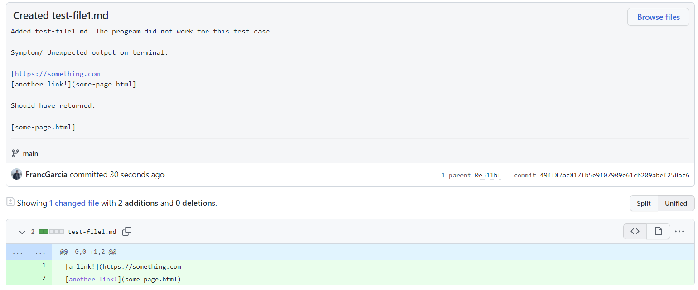
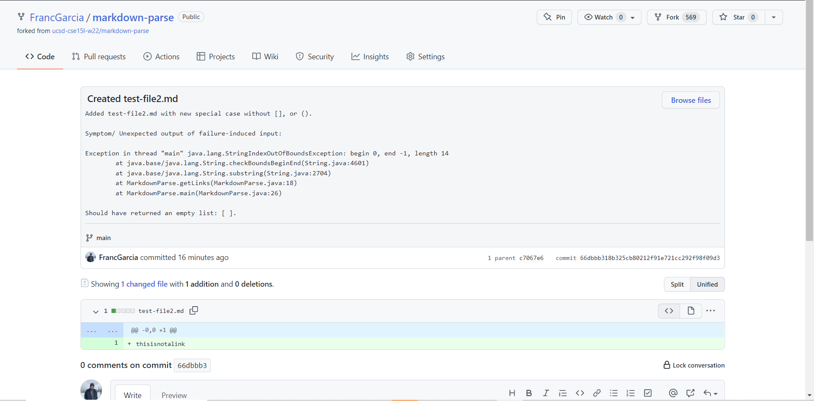
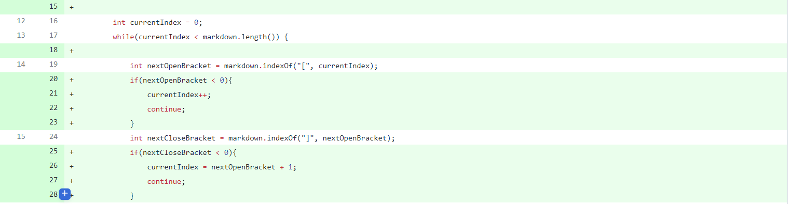
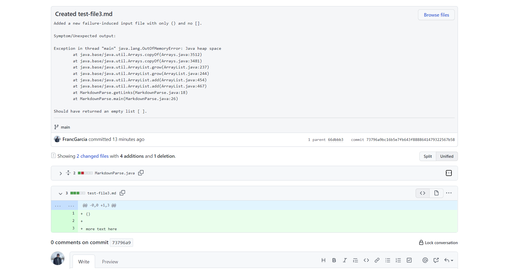

# Week 4 Lab Report 2

## Fixing Bugs

*By: **Francisco Garcia***

*Course: CSE15L*

---
**CODE CHANGE #1**

Here is [test-file1](https://github.com/FrancGarcia/markdown-parse/blob/main/test-file1.md) for the **first** *failure-induced input*.

**Relationship between sympton-failure induced input-bug:**
Within the example, the *symptom* produced from the *failure-induced input* (e.g. the contents) in `test-file1.md` was caused by a *bug* found within the body of the `while-loop` where `toReturn.add(markdown.substring(openParen + 1, closeParen))` returned the first line of contents although it should not have since it is not a link. This *symptom* occurred from including the contents of the first line in `test-file1.md`, where there was only one openbracket; and no closed brackets, and opened or closed parantheses. This *failure-induced input* caused the *bug* to return all of the contents in the file since `openParen` returned `-1`, and therefore `toReturn` was then assigned the `String` of **all** of the contents in `test-file1.md`, producing the *symptom*.

---

**CODE CHANGE #2**

Here is [test-file2](https://github.com/FrancGarcia/markdown-parse/blob/main/test-file2.md) for the **second** *failure-induced input*.

**Relationship between sympton-failure induced input-bug:**

---

**CODE CHANGE #3**

Here is [test-file3](https://github.com/FrancGarcia/markdown-parse/blob/main/test-file3.md) for the **third** *failure-induced input*.

**Relationship between sympton-failure induced input-bug:**
Within the example, the *symptom* produced from the *failure-induced input* (e.g. the contents) in `test-file3.md` was the output: `java.lang.OutOfMemoryError`. This implies that there was a *bug* in our code that was causing an `infinite-loop` which led to excepeding the Java heap space. After careful observation, we found that the *bug* was within the `while-loop` in which the condition `currentIndex < markdown.length()` was always true since `currentIndex` was always `0` and less than the length of the contents in `test-file3.md`, whenever there were no brackets or parantheses in the *failure-induced input*.

---

Date: January 28, 2022
