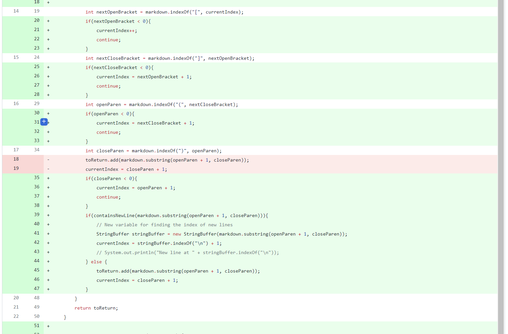

# Week 4 Lab Report 2

## Fixing Bugs

*By: **Francisco Garcia***

*Course: CSE15L*

---
**CODE CHANGE #1**

Here is [test-file1](https://github.com/FrancGarcia/markdown-parse/blob/main/test-file1.md) for the first *failure-induced input*.

**Description**

---

Bug 2

Here is [test-file2](https://github.com/FrancGarcia/markdown-parse/blob/main/test-file2.md) for the second *failure-induced input*.

**Description**

---

Bug 3

Here is [test-file3](https://github.com/FrancGarcia/markdown-parse/blob/main/test-file3.md) for the third *failure-induced input*.

**Description**

---

Date: January 28, 2022
