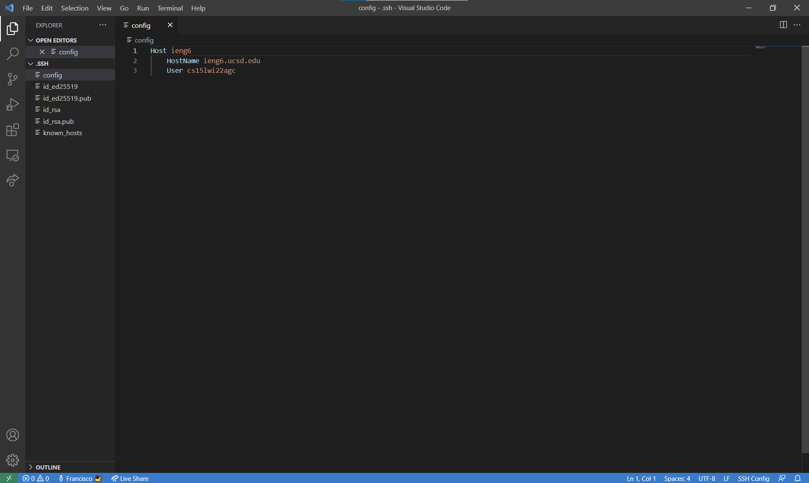
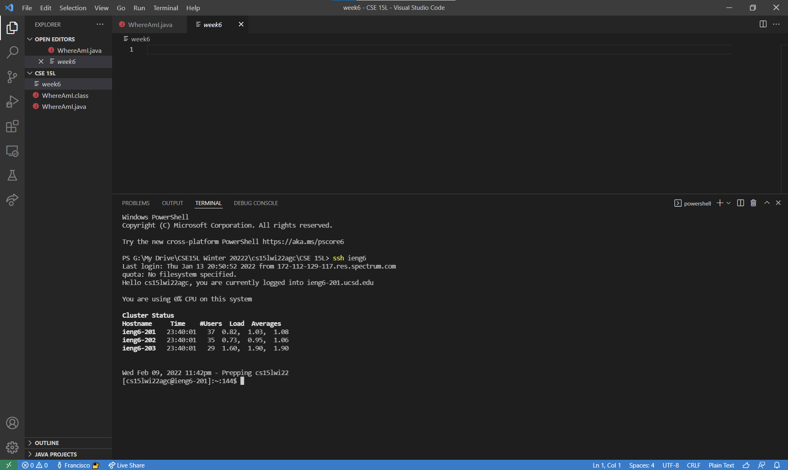
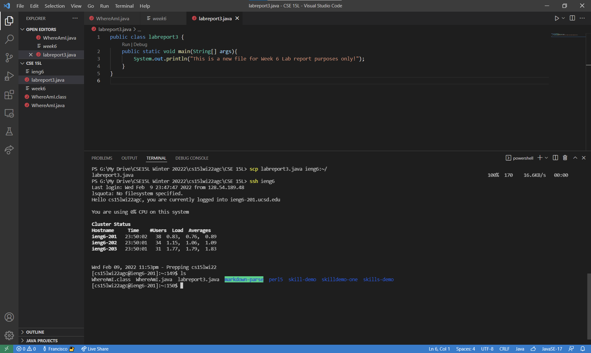

# Week 6 Lab Report 3

## Streamlining SSH Configuration

*By: **Francisco Garcia***

*Course: CSE15L*

---
**Editing the File in VSCode**



**Description:**

Editing the `.ssh` folder varies on different operating systems. Since I have a Windows laptop, I edited my `.ssh` folder by first finding it in my File Explorer under the `Users` directory. From there, I located the `config` file within the `.ssh` folder (the `.ssh` folder itself was within the `Francisco` folder since this is my laptop) and added:

```
Host ieng6
    HostName ieng6.ucsd.edu
    User cs15lwi22agc
```
By adding the above input, my terminal tells the system to recognize `ieng6` as the **alias** for logging into, or even copying files into my CSE15L course-specific account. The Hostname is the fullname of the server that the operating system accesses when using `.ssh` and `scp` commands.

The general classpath for this process looks like this `C:\Users\Francisco\.ssh`. It will look different for you. 

---

**Logging into Account Using the Alias**



**Description:**

When using `ssh ieng6` in the terminal, I am able to automatically login into my CSE15L course-specific account. The **alias** I used was `ieng6` as it is easier for me to remember what server I am using when logging into *cs15lwi22agc*. The streamline ssh configuration for logging into my course-specific account is very efficient as I no longer have to access the server using `ssh cs15lwi22agc@ieng6.ucsd.edu` in the terminal.

---

**Copying Files over Using SCP and Alias**



**Description:**

I first created a new file that prints basic output in the terminal when ran, naming it `labreport3.java`. From here, I used `scp labreport3.java ieng6:~/` in the terminal. This command copies `labreport3.java` into my *cs15lwi22agc* account within the server `ieng6.ucsd.edu`. **NOTE:** Adding `~/` is crucial as it is what actually transfers the copied file over into my username's server. Without it, the command will simply copy the file, but the file will not show up within your CSE15L course-specific account.

---

[Back to Main Page.](https://francgarcia.github.io/cse15l-lab-reports/cse15l-lab-reports-main-page.html)

Date: February 11, 2022
