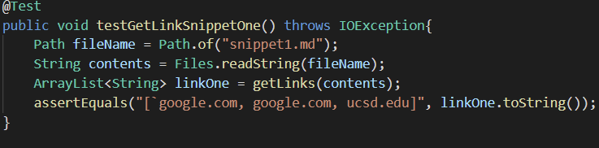
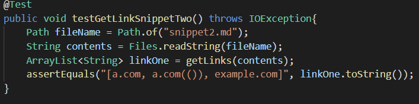
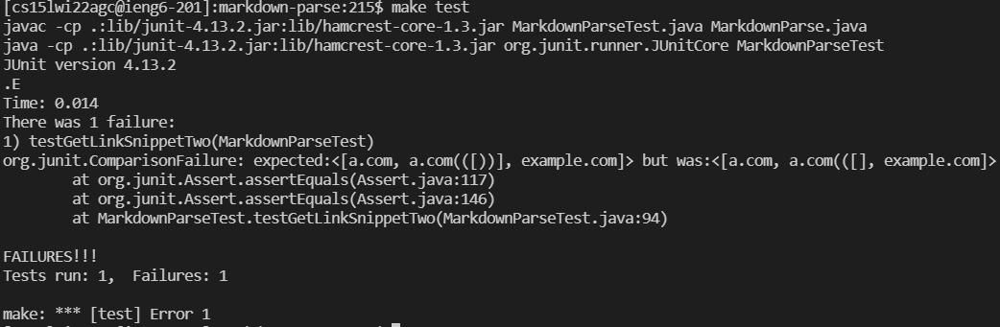
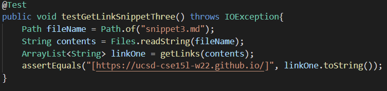
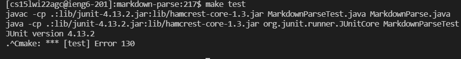
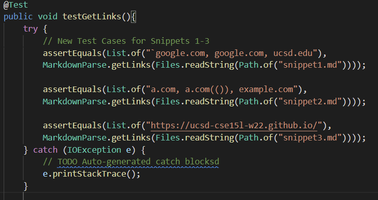
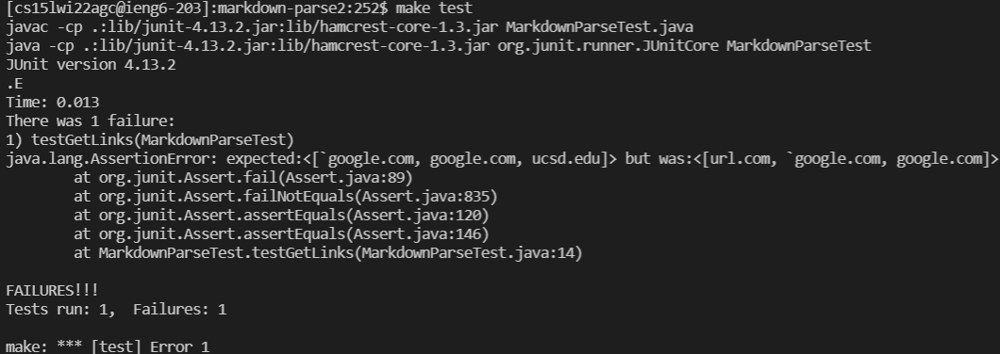
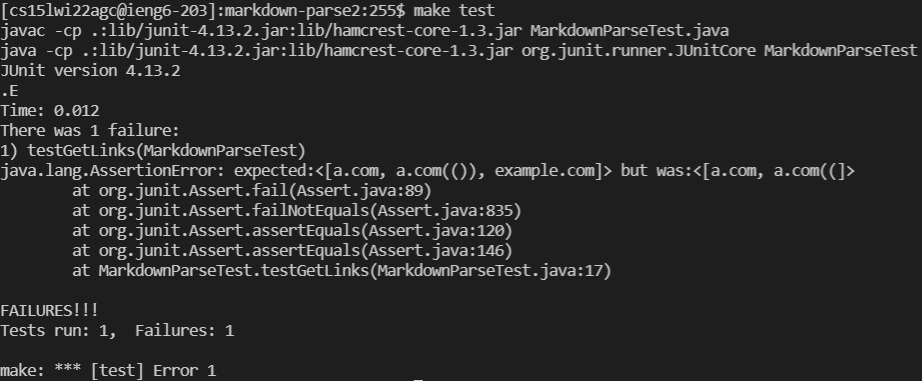
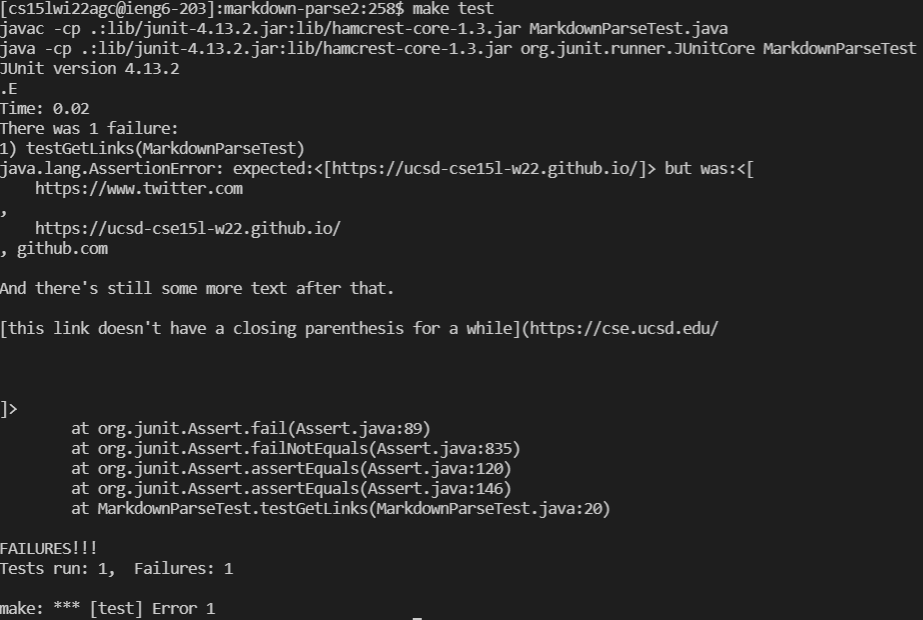

# Lab Report 1

## MARKDOWN-PARSE Repostories: Using JUnit to Test Snippets.

*By: **Francisco Garcia***

*Course: CSE15L*

---

## My [markdown-parse repository](https://github.com/FrancGarcia/markdown-parse).

According to the first image above, the expected output for the `snippet1.md` should be a list of links such as `['google.com, google.com, ucsd.edu]`. However, the initial JUnit test did not pass as it produced an unexpected output as seen in the second image above.

**How can we change the code to work for snippet 1?** 
I think we can use less than 10 lines of code to make the program work for snippet 1 and all related cases using backticks by simply using an if-statement within a for-loop. I can specifically treat the backticks as other `char` data and simply iterate through the `String` like I have already been doing in my current `MarkdownParse.java` file. Iterating through the `snippet1.md` file, I can use conditionals to simply check for open or closed brackets and parentheses.

---

According to the first image above, the expected output for the `snippet2.md` should be a list of links such as `[a.com, a.com(()), example.com]`. However, the initial JUnit test did not pass as it produced an unexpected output as seen in the second image above.

**How can we change the code to work for snippet 2?**
I think we can use less than 10 lines of code to make the program work for snippet 2 and all related cases by using additional conditional statements. I can specifically treat the first `[` or `(` as the initial information needed to render a link and all other nested brackets and parentheses are ignored. This process will continue until the last `]` or `)` are found in the link. If none are found, then the links are not rendered in the list.

---

According to the first image above, the expected output for the `snippet3.md` should be a list of links `[https://ucsd-cse15l-w22.github.io/]`. However, the initial JUnit test did not pass as it entered an infinite loop as the while-loop's condition was infinitely satisfied. As a result, I had to use `$ ^C` command to exit the infinite loop.

**How can we change the code to work for snippet 3?**
I think we can use less than 10 lines of code to make the program work for snippet 3 and all related cases as I am already using `StringBuffers`, and `\n` to check for the indices of new lines. I can implement using loops that iterates through the contents in a file and specifically finds `[` or `(`. Once it finds these `char`s then we can continue the iteration and using `StringBuffers` and `\n`, we can check if there is a new line, simultaneously. If there is a new line, then using the conditional statements, we can jump to the new lines and continue the iteration.

---

## The [repository](https://github.com/yi113/markdown-parse) that I reviewed.

According to the first image above, the expected output for the `snippet1.md` should be a list of links such as `['google.com, google.com, ucsd.edu]`. However, the initial JUnit test did not pass as it produced an unexpected output as seen in the second image above.

**How can we change the code to work for snippet 1?** 
I think I can use less than 10 lines of code to make the program work for snippet 1 and all related cases using backticks by using an if-statement to only check for backticks present inside the parentheses of the link itself. The current code takes into account backticks within the brackets which prevents the links from being rendered within the list of links. Using an if-statement, if there are backticks within the open and closed brackets, we simply ignore those backticks until we find the next set of parentheses.

---

According to the first image above, the expected output for the `snippet2.md` should be a list of links such as `[a.com, a.com(()), example.com]`. However, the initial JUnit test did not pass as it produced an unexpected output as seen in the second image above.

**How can we change the code to work for snippet 2?**
I think I can use less than 10 lines of code to make the program work for snippet 2 and all related cases by using additional conditional statements. I can specifically edit the current conditionals and loops to iterate through the contents and ignore any open or closed brackets within a set of brackets, as well as any open or closed parentheses within a set of parentheses. The code can use a temporary variable holder to hold the index of the initial `[` or `(` and ignore all other brackets and parentheses after those initial ones until we find the very last `]` or `)` instead of the first occurrences of those `char`s.

---

According to the first image above, the expected output for the `snippet3.md` should be a list of links `[https://ucsd-cse15l-w22.github.io/]`. However, the initial JUnit test did not pass as it produced an unexpected output as seen in the second image above. 

**How can we change the code to work for snippet 3?**
I do NOT think I can use less than 10 lines of code to make the program work for snippet 3 and all related cases. The current program includes all of the contents after the first set of `[]`. I would have to include code that accounts for new lines which entails including `StringBuffers` and `\n` behavior. This in itself will take about 5 lines of code in the program. In addition to these 5 lines of code, I would have to include more conditionals to restart the iterative process for searching for other sets of brackets and parentheses in the new lines.

---

[Back to Main Page.](https://francgarcia.github.io/cse15l-lab-reports/index.html)

Date: February 25, 2022
