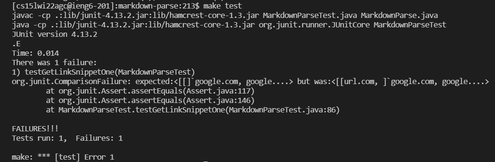

# Lab Report 1

## MARKDOWN-PARSE Repostories: Using JUnit to Test Snippets.

*By: **Francisco Garcia***

*Course: CSE15L*

---

## My [markdown-parse repository](https://github.com/FrancGarcia/markdown-parse).

According to the first image above, the expected output for the `snippet1.md` should be a list of links such as `[`google.com, google.com, ucsd.edu]`. However, the initial JUnit test did not pass as it produced an unexpected output as seen in the second immage above.

**How can we change the code to work for snippet 1?**

---

According to the first image above, the expected output for the `snippet1.md` should be a list of links such as `[a.com, a.com(()), example.com]`. However, the initial JUnit test did not pass as it produced an unexpected output as seen in the second immage above.

**How can we change the code to work for snippet 2?**

---

According to the first image above, the expected output for the `snippet1.md` should be a list of links `[https://ucsd-cse15l-w22.github.io/]`. However, the initial JUnit test did not pass as it produced an unexpected output as seen in the second image above. 

**How can we change the code to work for snippet 3?**

---

## The  that I reviewed.

**How can we change the code to work for snippet 1?**

**How can we change the code to work for snippet 2?**

**How can we change the code to work for snippet 3?**

---

Date: February 25, 2022
