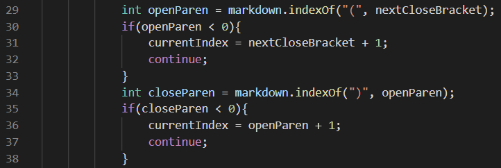

# Week 10 Lab Report 5

## Comparing Repositories and Code

*By: **Francisco Garcia***

*Course: CSE15L*

---
## Test 1

**Difference in Results:**


**Which test file is it:**


**Contents of the test file 22.md:**


**How I Compared:**

To compare the two repositories and their results for this test, I utilized the command `diff markdown-parse/results.txt cse15l-markdown-parse/markdown-parse/results.txt`. `markdown-parse/results.txt` represents my repository while `cse15l-markdown-parse/markdown-parse/results.txt` represents the repository shared with us in Week 9. This command shows the different results for my implementation versus the provided implementation. According to the difference in results, we must check lines of the `results.txt` file. For the sake of time, I chose to check lines 270 and lines 876 for the two tests. According to the `results.txt` file, the first corresponding `test-file` is `22.md` found within `test-files`. This process is shown in the images above.

**Which is a Correct Implementation?:**

According to this [commonmark demo](https://spec.commonmark.org/dingus/), the contents in file `22.md` should be included as a link. Therefore, my implementation is correct, while the provided implementation is incorrect as this implementation did not include the link. This is seen in the image above, specifically by:

```
270c270
> [/bar\* "ti\*tle"]
---
< []
```

The above output describes how my implementation included the link within the list as seen above `---`. The output also describes how the provided implementation did not include the link within the list as seen by the empty list below `---`.

**What is the Bug?:**


The provided implementation does not include links with spaces anywhere in the contents, whereas my implementation does. This bug is found within lines 74-78 in the above image of the provided implementation. Within those lines, the String `potentialLink` is set to the contents within the file. However, within the conditions of the `if-statement`, the code adds the contents of the String to the list of links only if there are no spaces or new lines. `potentialLink.indexOf(" ")` will return `-1` if there are no spaces within the string of `potentialLink`. `potentialLink.indexOf("\n");` will return `-1` if there are aren't any new lines within `potentialLink`. If these two conditions are satisfied, *then* the String `potentialLink` will be added. However, since there are spaces within `potentialLink` specifically for the contents of `[foo](/bar\* "ti\*tle")`, the String will *not* be added to the list of links producing the incorrect output. To fix this, I can simply remove this faulty condition from lines 74-78. This will essentially include any String links with spaces within them.

---

## Test 2

**Difference in Results:**


**Which test file is it:**


**Contents of the test file 494.md:**


**How I Compared:**

To compare the two repositories and their results for this test, I also utilized the command `diff markdown-parse/results.txt cse15l-markdown-parse/markdown-parse/results.txt`.  For the sake of time, I chose to check line 876 for the second test. According to the `results.txt` file, the other corresponding `test-file` I'm comparing is `494.md` found within `test-files`. This process is shown in the images above.

**Which is a Correct Implementation?:**

According to this [commonmark demo](https://spec.commonmark.org/dingus/), the contents in file `494.md` should be included in the list of links. However, the proper contents of the link should be `(foo)`, according to [commonmark demo](https://spec.commonmark.org/dingus/). Therefore, both implementations are incorrect as seen below: 

```
876c878
< [\(foo\]
---
> [\(foo\)]
```

The above output describes how my implemenation included `\(foo\` above `---`. The output also describes how the provided implementation included `\(foo\)` as seen below the `---`.

**What is the Bug?:**



For timely purposes, I will describe the bug in my implementation. As seen within the above image, my implementation sets the variable `openParen` in line 29 to the first occurence of `(` within the String `markdown`, which contains the contents of a potential link. My implementation will then iterate through the String until it finds the first occurrence of `)`, setting `closeParen` to the index of the first occurrence of that character in line 34. My implementation then includes this first set of parenthesis within the list of links, ignoring all other possible parenthesis within the contents of the file. For the example, the file `494.md` contains the contents `[link](\(foo\))` as a String. My code will set `openParen` to the value of `6` and `closeParen` to the value of `13`. My implementation will then include the characters from index `6` to index `13` exclusive, producing `\(foo\` as the output link. To fix this, I can change `openParen` to the last occurrence of `(` before any `)`. I can then change `closeParen` to the last occurrence of `)` after setting `openParen` to a valid number other than `-1`. This will essentially produce `(foo)`, instead of `\(foo\`.

---


[Back to Main Page.](https://francgarcia.github.io/cse15l-lab-reports/index.html)

Date: March 11, 2022
