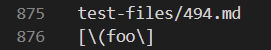

# Week 10 Lab Report 4

## Comparing Repositories and Code

*By: **Francisco Garcia***

*Course: CSE15L*

---
## Test 1

**Difference in Results:**


**Which test file is it:**


**Contents of the test file 22.md:**


**How I Compared:**

To compare the two repositories and their results for this test, I utilized the command `diff markdown-parse/results.txt cse15l-markdown-parse/markdown-parse/results.txt`. `markdown-parse/results.txt` represents my repository while `cse15l-markdown-parse/markdown-parse/results.txt` represents Professor Joe's repository. This command shows the different results for my implementation versus Joe's implementation. According to the difference in results, we must check lines of the `results.txt` file. For the sake of time, I chose to check lines 270 and lines 850 for the two tests. According to the `results.txt` file, the first corresponding `test-file` is `22.md` found within `test-files`. This process is shown in the images above.

**Which is a Correct Implementation?:**

According to this [commonmark demo](https://spec.commonmark.org/dingus/), the contents in file 22.md should be included in the resultint list of links as it produces a link. Therefore, my implementation is correct, while Joe's is incorrect as his implementation did not include the link. This is seen in the image above, specifically by:

```
270c270
> [/bar\* "ti\*tle"]
---
< []
```

The above output describes how my implemenation included the link within the list as seen above `---`. The output also describes how Joe's implementation did not include the link within the list as seen by the empty list below `---`.

---

## Test 2

**Difference in Results:**


**Which test file is it:**



**Contents of the test file 481.md:**


**How I Compared:**

To compare the two repositories and their results for this test, I utilized the command `diff markdown-parse/results.txt cse15l-markdown-parse/markdown-parse/results.txt`. `markdown-parse/results.txt` represents my repository while `cse15l-markdown-parse/markdown-parse/results.txt` represents Professor Joe's repository. This command shows the different results for my implementation versus Joe's implementation. According to the difference in results, we must check lines of the `results.txt` file. For the sake of time, I chose to check lines 270 and lines 850 for the two tests. According to the `results.txt` file, the other corresponding `test-file` I'm comparing is `481.md` found within `test-files`. This process is shown in the images above.

**Which is a Correct Implementation?:**

According to this [commonmark demo](https://spec.commonmark.org/dingus/), the contents in file 481.md should be included in the list of links. Therefore, my implementation is incorrect as it wasn't included in the list of links, according to the image above displaying the difference in results. Joe's implementation is correct as the contents were rendered as a link. This is specifically seen in: 

```
850c850
> [/uri "title"]
---
< []
```

The above output describes how my implemenation did include the link within the list as it is above `---`. The output also describes how Joe's implementation did include the link within the list as seen below `---`.

---


[Back to Main Page.](https://francgarcia.github.io/cse15l-lab-reports/index.html)

Date: March 11, 2022
