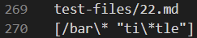

# Week 10 Lab Report 5

## Comparing Repositories and Code

*By: **Francisco Garcia***

*Course: CSE15L*

---
## Test 1

**Difference in Results:**


**Which test file is it:**



**Contents of the test file 22.md:**


**How I Compared:**

To compare the two repositories and their results for this test, I utilized the command `diff markdown-parse/results.txt cse15l-markdown-parse/markdown-parse/results.txt`. `markdown-parse/results.txt` represents my repository while `cse15l-markdown-parse/markdown-parse/results.txt` represents the repository shared with us in Week 9. This command shows the different results for my implementation versus the provided implementation. According to the difference in results, we must check lines of the `results.txt` file. For the sake of time, I chose to check lines 270 and lines 876 for the two tests. According to the `results.txt` file, the first corresponding `test-file` is `22.md` found within `test-files`. This process is shown in the images above.

**Which is a Correct Implementation?:**

According to this [commonmark demo](https://spec.commonmark.org/dingus/), the contents in file 22.md should be included in the resultint list of links as it produces a link. Therefore, my implementation is correct, while the provided implementation is incorrect as this implementation did not include the link. This is seen in the image above, specifically by:

```
270c270
> [/bar\* "ti\*tle"]
---
< []
```

The above output describes how my implementation included the link within the list as seen above `---`. The output also describes how the provided implementation did not include the link within the list as seen by the empty list below `---`.

**How to Fix the Bug:**


The provided implementation does not include links with spaces anywhere in the contents, whereas my implementation does. This bug is found within lines 74-78 in the above image of the provided implementation. Within those lines, the String `potentialLink` is set to the contents within the file. However, within the conditions of the `if-statement`, the code adds the contents of the String to the list of links only if there are no spaces or new lines. To fix this bug, we can simply delete the code from lines 74-78 altogether. This will fix the bug because I lack a similar behavior in my implementation, however, my code *does* include the link.

---

## Test 2

**Difference in Results:**


**Which test file is it:**


**Contents of the test file 494.md:**


**How I Compared:**

To compare the two repositories and their results for this test, I utilized the command `diff markdown-parse/results.txt cse15l-markdown-parse/markdown-parse/results.txt`. `markdown-parse/results.txt` represents my repository while `cse15l-markdown-parse/markdown-parse/results.txt` represents Professor Joe's repository. This command shows the different results for my implementation versus Joe's implementation. According to the difference in results, we must check lines of the `results.txt` file. For the sake of time, I chose to check lines 270 and lines 876 for the two tests. According to the `results.txt` file, the other corresponding `test-file` I'm comparing is `494.md` found within `test-files`. This process is shown in the images above.

**Which is a Correct Implementation?:**

According to this [commonmark demo](https://spec.commonmark.org/dingus/), the contents in file 494.md should be included in the list of links. However, the proper contents of the link should be `(foo)`, according to [commonmark demo](https://spec.commonmark.org/dingus/). Therefore, both implementations are incorrect as seen below: 

```
876c878
< [\(foo\]
---
> [\(foo\)]
```

The above output describes how my implemenation included `\(foo\` above `---`. The output also describes how the provided implementation included `\(foo\)` as seen below the `---`.


**How to Fix the Bug:**

For timely purposes, we can fix the bug in my implementation by (INSERT). 

---


[Back to Main Page.](https://francgarcia.github.io/cse15l-lab-reports/index.html)

Date: March 11, 2022
