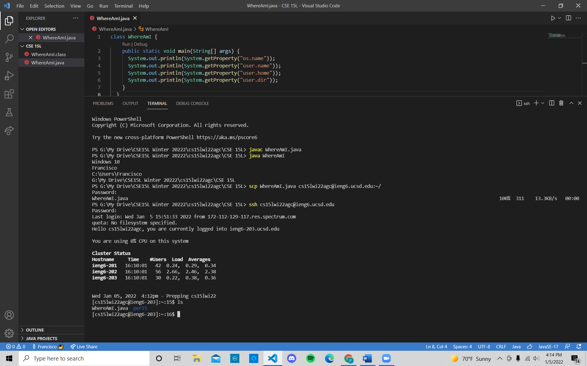

# **STEP 4: Moving Files with SCP**
Now, let's say that you want to move files from your computer to a remote computer/server.
One way to do this is by using the `scp` command on your client (not when you're logged into a server like `ieng6`).

**Try this:**
1. Create a file on your computer called `WhereAmI.java`.
2. Copy and paste these contents into the file:
   ```
   class WhereAmI {
    public static void main(String[] args) {
     System.out.println(System.getProperty("os.name"));
     System.out.println(System.getProperty("user.name"));
     System.out.println(System.getProperty("user.home"));
     System.out.println(System.getProperty("user.dir"));
    }
   }
   ```
3. Run the file using `javac` and `java` commands as you have learned in previous courses (*CSE11 or CSE8B*). Skip this step if you don't have `java` installed in your computer.
4. Now run `scp WhereAmI.java cs15lwi22agc@ieng6.ucsd.edu:~/` with `cs15lwi22agc` replaced with your username. You should be asked for a password (it is the same as when you logged into your course-specific account using `ssh` in **STEP 2**).
5. Now log back into `ieng6` like you did in **STEP 2** and enter `ls` in the terminal. You will find the WhereAmI.java file in your home directory.
   You can run this file in `ieng6` now, using `javac` and `java`.
   


The image above shows what the same steps that I took (as described above), and the WhereAmI.java file in the home directory.


