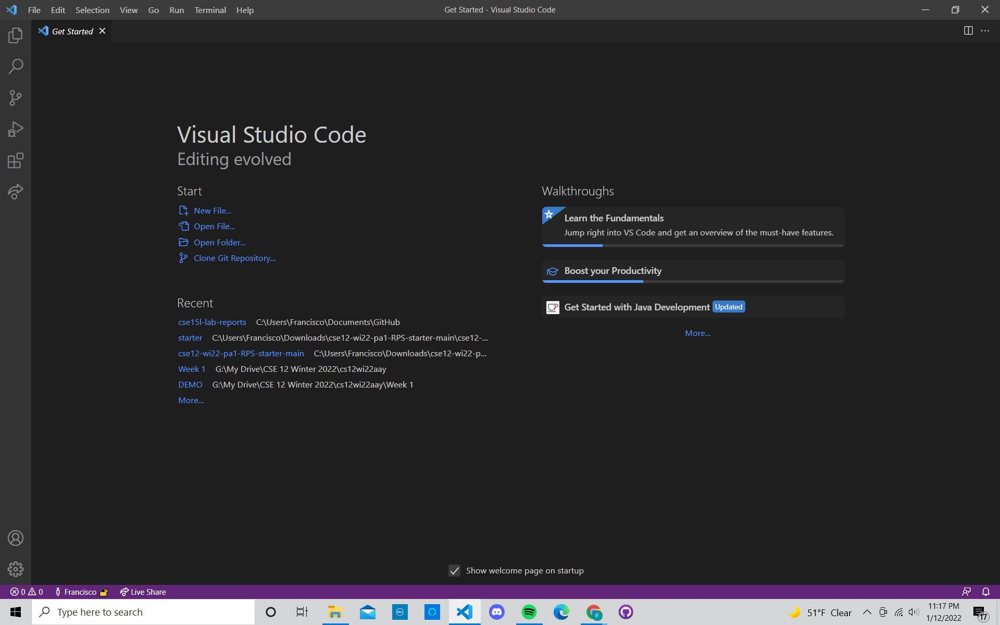

# **STEP 1: Installing VSCode**

VSCode (aka Visual Studio Code) is an Integraded Developer Environment.
There are versions for all major operating systems such as Windows or OSX systems.

To install in Windows, visit the VSCode website and click on the "Download for Windows" button.
Ensure to download the most recent version (should be 64 bits).

Allow it to download, then open the application by searching for VSCode in your taskbar search 
menu at the bottom left of your computer.

Once opened, VSCode should look something like this:

**Visit [STEP 2](https://francgarcia.github.io/cse15l-lab-reports/remoteconnect.html) or go back to the [main blog post](https://francgarcia.github.io/cse15l-lab-reports/lab-report-1-week-2.html).**
